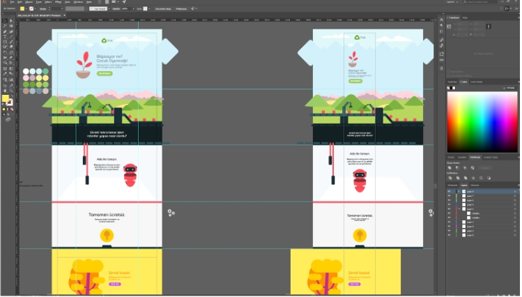

Ana Ekran Tasarımı

<!-- more -->

#### Ana Ekran Tasarımı

Projenin ana ekran tasarımında kaydırdıkça gözüken 4 bölüm bulunmaktadır. Bu bölümler ekran kaydırdıkça perspektifi değiştirerek sanki ekran üç boyutluymuş gibi gözüken erkranlardır.

> Bunu yapmamızdaki amaç, çocukların sayfaya olan ilgisini çekmek ve daha sonrasında ise bu ilgiyi yöneterek eğlenceli bir şekilde bilgi edinmelerini sağlamaktır.

Ana ekranda kullanılan ilk “POD”, oyuna başlandığında ilk ekilecek olan _bitkiyi_ ifade eder. Resimlerden de gördüğünüz üzere, ekranda bir çok hareketli nesne bulunmaktadır. Örneğin paranın dönüşü, robotun uçuşu, bulutların süzülüşü ve kutuların ilerleyişi gibi. Bu animasyonlar, kullanıcıyı sıkmadan bilgiyi aktarmak ve sayfada geçirilen süreyi arttırmak için tasarlanan küçük bileşenlerdir.

> [Site Adresi](https://pod.xava.me/)

> Not: Mobil versiyon sitede şu anlık çalışmamaktadır.
