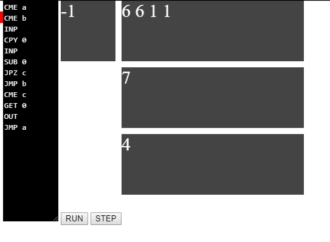

Betik Dili Nedir?, POD İçinde Betik Dili, Betik Dili Operasyon Kodları

<!-- more -->

#### Betik Dili Nedir?

Betik Dili (Scripting/Script Language), **betik yorumlamak** için yazılmış özel çalışma-zamanı sistemlerinin (run-time environment) yorumlayabileceği programlama dilleridir. Diğer programlama dilleri ile yazılan kodlar makine koduna çevrilip çıkan program doğrudan çalıştırılırken betik kodları **interpreter** tarafından doğrudan okunur ve yorumlanarak işlemler interpreter'ın kendisi tarafından yapılır. Betik dillerinin en önemli farkı, derleme adımına ihtiyaç duymamasıdır. Bu diller, yorumlanarak çalışır.

Örneğin, normalde, bir C programının çalıştırmadan önce derlenmesi gerekirken JavaScript veya PHP gibi bir betik dili derlenmeden çalışabilir.

#### POD İçinde Betik Dili

Projeyi tasarlarken üzerinde durduğumuz en önemli şey, bu projenin, çocuklara programlama ve algoritma öğreten diğer hiçbir projeye benzememesini sağlamaktır. Bunun için diğer projelerdeki gibi iç içe geçen bloklar kullanmak yerine daha sade, problemi kısıtlı kaynaklarla çözmeye zorlayan bir betik dili geliştirmeye karar verdik. Projede kullanılacak olan betik dilinin ilk prototiplerini yapmış bulunmaktayız.

Aşağıdaki şekilde giriş olarak verilen her iki sayıyı karşılaştıran, eşitse çıkışa koyan bir program yazılmıştır. Bunun dışında sıfırları eleyen, her sayıyı sekizle çarpan, her iki sayıyı tersten yazan, sadece tek sayıları bulan programlar da yazmak mümkündür.

#### Betik Dili Operasyon Kodları

Aşağıda, betik dilinden proje içinde kullanılan bazı **operasyon kodu** örnekleri verilmiştir:

**CME** : Come. JMP veya JMZ’den dönüş için kullanılır.
**INP** : Input. Girdi dizisinden bir eleman almak için kullanılır.
**OUT** : Output. Çıktı dizisine eldeki elemanı vermek için kullanılır.
**CPY** : Copy. Eldeki elemanı bellek kısmına kopyalamak için kullanılır.
**GET** : Get. Bellekteki elemanı ele kopyalamak için kullanılır.
**SUB** : Substract. Eldeki elemandan bellekteki elemanı çıkartmak için kullanılır.
**ADD** : Add. Eldeki eleman ile bellekteki elemanı toplamak için kullanılır.
**JMP** : Jump. Aynı etikete sahip CME satırına koşulsuz atlamak için kullanılır.
**JPZ** : Jump If Zero. Aynı etikete sahip CME satırına eldeki eleman sıfır olmak koşuluyla atlamak için kullanılır.

Kaynaklar : [Wikipedia](https://tr.wikipedia.org/wiki/Betik_dili)
