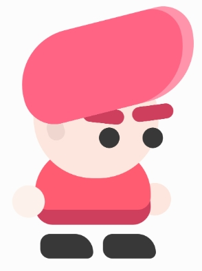

Kasu, Kasu Tasarım, Kasu Animasyon

<!-- more -->

#### Kasu Tasarım

> Bu hafta oyunun ana karakteri olan _Kasu_ için bir component tanımladık.

Bu komponentin içerisine dinamik olarak _prop_ alabilen alt komponentler tanımladık. Böylece üst komponentte bir prop değişimini alt komponente atarak _state management_’i kolaylaştırdık.

> Problem, her bir komponentin üst üste render edilmesiydi.

Örneğin Kasu’nun gözlüğünün, Kasu’nun sadece kafasını etkilemesi ve kafası hareket ettiğinde, gözlüğün de kafa ile beraber hareket etmesi gerekiyordu. Ancak gözlerin hareketi, gözlüğün hareketini etkilememeliydi. Ayrıca gözlük, gözlerin her zaman üstüne olmalıydı. Son olarak, gözleri tamamen kapayan gözlüklerin, gözleri gizlemesi gerekiyordu. Son olarak, gözlüğün kafanın arkasında değil, önünde render edilmesi gerekiyordu. Tüm bu problemleri ana komponentte düzenlememiz oldukça kafa karıştırıcı olabilirdi. Bu yüzden karakter bölümlendirmeyi buna göre belirledik.

İşin sonunda elimizde tamamen kişiselleştirebildiğimiz, küçük bölümlere bölünmüş bir karakter vardı. Rengini ve kullandığı eşyaları değiştiren bir ekran tasarlayacağız. Böylece kullanıcı, mağazadan aldığı eşyaları kuşanabilecek.

#### Kasu Tasarım

Aynı zamanda bu hafta, Kasu’nun CSS animasyonunu gerçekleştirdik. Bunu yaparken _Chrome Dev Tools_’un sağlamış olduğu _Animations_ kısmı çok büyük yarar sağladı. Animasyonların zamanını ayarlamak ve Kasu’nun nefes alıp veriyormuş gibi salınmasını sağlamak, Kasu’ya canlılık kattı. Aynı zamanda, parçaların aynı animasyon class’ını kullanması, koddaki tekrarlığı azalttı.

