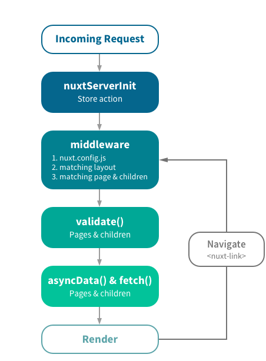

NuxtJS Nedir,Nasıl Çalışır

<!-- more -->

#### NuxtJS Nedir ?
NuxtJS VueJS,BabelJS,Webpack,NodeJS tabanlı web uygulamaları geliştirilmek için progressive bir frameworktür. NuxtJS VueJS geliştiricileri için kolay ve hızlı web uygulamaları geliştirmek için 
altyapı oluşturmayı hedefler.  Universal Vue Application(Sunucu taraflı rendering) üretmemize imkan tanır. Dosya klasör yapısını kullanarak konfigürasyon yapar. 
VueJS çok performanslı bir frameworktür. NuxtJS kullanıcı ile sunucu aransındaki Asynchronous Data, Middleware, Layouts vb. gibi geliştirmelerinizde,size yardımcı olan bir çok özelliği barındırıyor. NuxtJS , VueJS uygulamalarımızı daha kolay ve esnek inşa etmemizi sağlar. 

#### Server Side Rendering Nedir ?
VueJs istemci tabanlı rendering yapan bir Javascript frameworküdür.İstemci tabanlı rendering olayının avantajlı yanları olduğu gibi dezavantajlı yanlarıda vardır.
Bunlardan en önemlisi SEO(Arama motoru optimizasyonu) geliyor.NuxtJS sunucu taraflı rendering yaparak hem SEO açısından hem de arayüzümüzün daha hızlı açılmasını sağlıyor.

#### Çalışma Yapısı 
Aşağıdaki resimde bir kullanıcı uygulamamızda gezerken NuxtJS`in çalışma yapısını anlatıyor.

#### Özellikleri

-Sunucu taraflı rendering
-Güçlü routing sistemi
-Statik VueJS dosyası
-Kod ayırma sistemi

#### Nasıl Çalışır
NuxtJS bu paketleri içerir:
-Vue 2
-Vue Router
-Vuex
-Vue Server Renderer
-Vue Meta

Kaynaklar : [oguzhanaslan](https://oguzhan.in/nuxt-js-universal-vue-js-applications/) [NuxtJS](https://nuxtjs.org/guide)