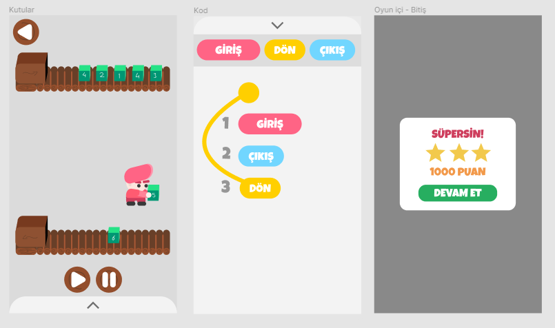
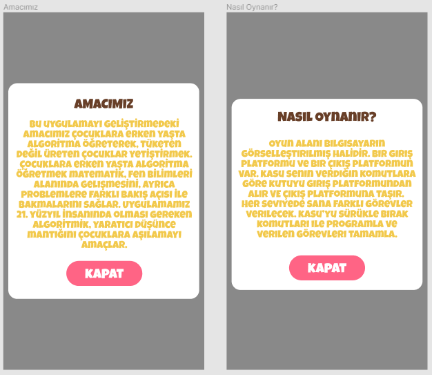

Prototip -1

<!-- more -->

#### Pod | Prototip -1

Prototipimizi **Figma** üzerinden yaptığımızı daha önceden söylemiştik.

> Figma'nın ne olduğunu ve nasıl çalıştığını merak ediyorsanız, [buradan](https://wepod.github.io/blog/Figma) **Figma** adlı başlığımıza ulaşabilirsiniz.

Prototipin başlangıcında oluşturacağımız sayfaları uygulama ve kullanıcı açısından grupladık. Daha sonra bunları açarak, aşağıdaki ekran sayfalarını oluşturduk;

- Yükleme Ekranı
- Başlangıç Ekranı
- Harita Ekranı
- Bölümler Ekranı
- Bölüm Ekranı
- Editör Ekranı
- Bitiş Ekranı
- Giriş Yap Ekranı
- Kayıt Ol Ekranı
- Destek Ekranı
- Nasıl Oynanır? Ekranı
- Amacımız Ekranı

#### Yükleme Ekranı

Yükleme ekranı oyunun açıldığından başlamaya hazır olduğu bölümü kapsamaktadır. Prototipte bu bölüm için dört ekran bulunmaktadır. Yavaş geçiş ile **yüklenme efekti** izlenimi verilmiştir.

#### Başlangıç Ekranı

Başlangıç ekranında kullanıcı birçok işlem yapabilir. Buradaki metinlerle **beş** farklı ekrana geçiş yapabilir. Kullanıcı;

- Başla butonu ile oyuna başlayabilir,
- Nasıl oynanır butonu ile oyunun nasıl oynandığını anlatan ekrana erişebilir,
- Hesabım var butonu ile hesabına giriş yapabilir,
- Destek butonundan destek sayfasına erişebilir,
- Ya da amacımız butonu ile uygulamanın neden yapıldığını anlatan amacımız sayfasını görüntüleyebilir.

#### Harita Ekranı

Oyunun bölümlerinin grupça bulunduğu ekrandır.

> Oyun bölümlerini ağacın yaprak ve dallarına benzetirsek, aynı özellikteki bölümlerin bulunduğu grup bir ağaç, ağaçların bulunduğu büyük gruba da orman benzetmesi yapmış oluruz. Bu şekilde çocuklara **pozitif** bir mesaj da vermeyi hedefledik.

Bu ekranda üç çeşit olmak üzere toplam altı ormanımız bulunuyor. Bunlar;

- Belgrad
- Redwood
- Monteverde
- Jiuzhaigou
- Great Bear
- Crooked

#### Bölümler Ekranı

Bölümlerin bir arada bulunduğu, **ağaç** benzetmesini yaptığımız sayfa bu ekrandadır. İçinde bir bölüm bulunsa da şu an mevcut **üç farklı ağaç tipi**miz vardır.

#### Bölüm - Editör - Bitiş Ekranları

> Bu ekranlar birbiriyle etkileşimli olduğundan tek başlık altında anlatmak istiyoruz.

Kullanıcının oyunu oynadığı bölümdür. Ağaçtan seçtiği yaprak ile ilgili bölümü açar. Şu an mevcut bir oyunumuz bulunuyor.

Bölümümüzde kullanıcıdan verilen bir dizi kutuların karşı tarafa yani çıkış bölümüne sırayla iletilmesi isteniyor. Kullanıcı bölümün alt kısmında bulunan ok ile **editör sayfası**nı açıp ilgili **mantıksal sistemi** kurması gerekiyor. Kullanıcı algoritmayı kurduktan sonra küçük arkadaşımız kutuları sırasıyla karşı tarafa iletmeye başlıyor.

Kullanıcı bölümü bitirdiğinde karşısına bitiş ekranı geliyor. Burada performansı ve kazandığı puan gibi bilgiler kullanıcıya gösteriliyor.
Kullanıcı devam et diyerek sonraki bölüme geçiş yapabilir.

#### Giriş Yap - Kayıt Ol Ekranları

Kullanıcı başlangıçta hesabım var butonu ile giriş yapma ekranına ulaşabileceğini söylemiştik. Bu ekranda kullanıcı;

- Oyuna kayıt olduğu e-posta ve şifresi ile hesabına giriş yapabilir,
- Cihazın hesabını tanıması için beni hatırla butonuna tıklayabilir,
- Şifremi unuttum butonu ile şifresini kurtarabilir,
- Veya kayıt ol butonu ile oyuna kayıt olabilir.

#### Nasıl Oynanır? - Amacımız Ekranları

Kullanıcı bu iki ekrana da başlangıç ekranından ilgili butonlara tıklayarak ulaşabilmektedir.

Nasıl oynanır ekranında, kullanıcıya onunun nasıl oynanıldığı, oyunun fiziksel ve mantıksal mekaniği anlatılmaktadır.

Amacımız ekranında ise bizim uygulamayı neden yaptığımız, amacımızın ve hedeflerimizin ne olduğu ile ilgili metinler bulunmaktadır.

#### Figma Önizleme

Buradan protipi inceleyebilir ve devamında yapacağımız değişiklikleri ve güncellemeleri takip edebilirsiniz.

<iframe src="https://www.figma.com/embed?embed_host=share&url=https%3A%2F%2Fwww.figma.com%2Fproto%2F1BO43LpuV9KIt6UcbDx6y2%2FPOD-Prototype%3Fnode-id%3D12%253A167%26scaling%3Dscale-down" frameborder="0" style="overflow:hidden;height:800px;width:100%;"></iframe>

Düzgün görüntülenmiyorsa [buraya tıklayın](https://www.figma.com/proto/1BO43LpuV9KIt6UcbDx6y2/POD-Prototype?node-id=3%3A60&scaling=scale-down)
